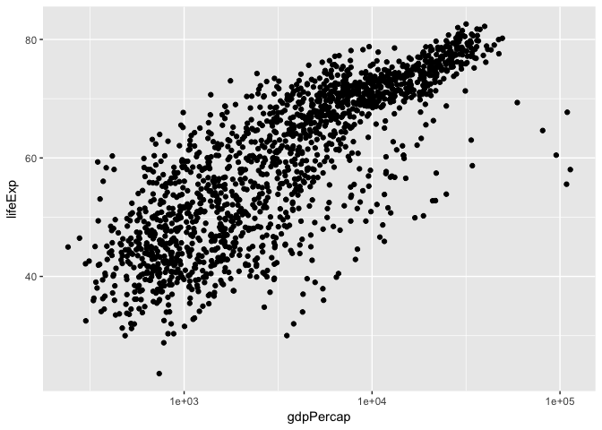
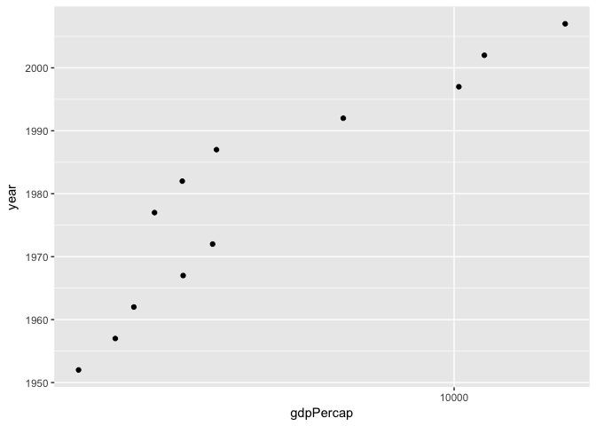
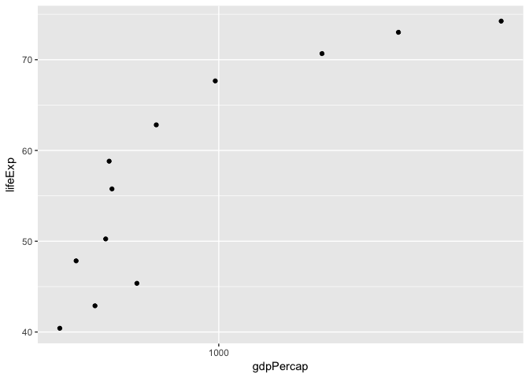

Gapminder-hw01
================
Aisha Uduman
9/18/2017

R Markdown for Homework 1
=========================

Exploring gapminder.

-   Polish and extend R Markdown doc from Sept 14 class
-   Render it to the github\_document output format
-   Commit both .Rmd and .md files and push them to Github

``` r
library(gapminder)
library(tidyverse)
```

    ## Loading tidyverse: ggplot2
    ## Loading tidyverse: tibble
    ## Loading tidyverse: tidyr
    ## Loading tidyverse: readr
    ## Loading tidyverse: purrr
    ## Loading tidyverse: dplyr

    ## Conflicts with tidy packages ----------------------------------------------

    ## filter(): dplyr, stats
    ## lag():    dplyr, stats

``` r
p <- ggplot(filter(gapminder, continent != "Oceania"),
            aes(x = gdpPercap, y = lifeExp)) # just initializes
p <- p + scale_x_log10() # log the x axis the right way
p + geom_point()
```



``` r
table(gapminder$continent)
```

    ## 
    ##   Africa Americas     Asia   Europe  Oceania 
    ##      624      300      396      360       24

``` r
barplot(table(gapminder$continent))
```


``` r
p <- ggplot(filter(gapminder, country == "Chile"),
            aes(x = gdpPercap, y = year)) # just initializes
p <- p + scale_x_log10() # log the x axis the right way
p + geom_point()
```



``` r
p <- ggplot(filter(gapminder, country == "Vietnam"),
            aes(x = gdpPercap, y = lifeExp)) # just initializes
p <- p + scale_x_log10() # log the x axis the right way
p + geom_point()
```


